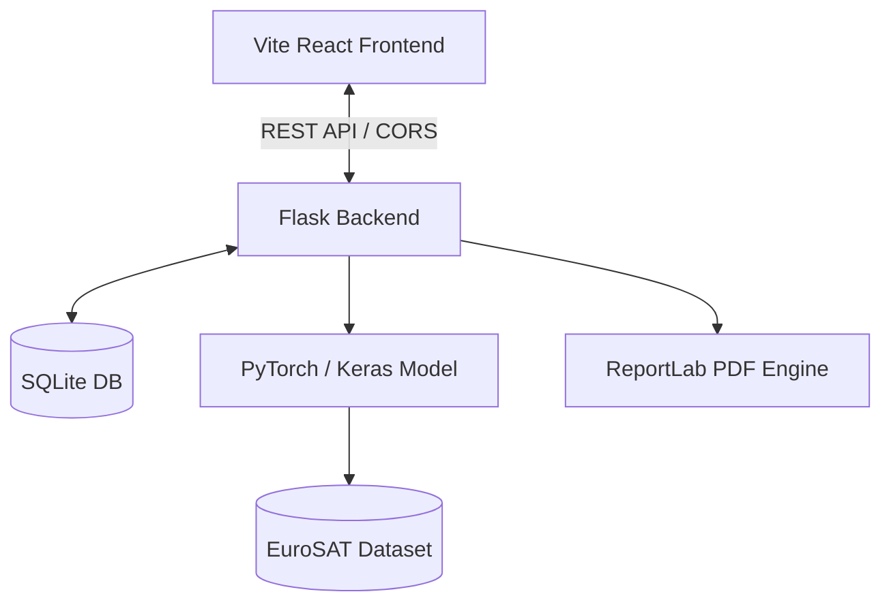

# System Architecture & Technical Specifications

This document provides a comprehensive breakdown of the technologies, libraries, and architectural modules utilized in the **Satellite Land Classification and Change Detection System**, detailing the purpose of each component.

---

## High-Level Architecture Overview

The system is designed as a decoupled client-server application:
1. **Frontend**: A high-performance SPA (Single Page Application) built using React, Vite, and Tailwind CSS. It communicates with the backend via RESTful APIs.
2. **Backend**: A Python Flask application responsible for database management (SQLite), deep learning execution (PyTorch/Keras 3), report generation, and geographic analytics.

---

## 1. Backend Stack & Modules (`backend/`)

The backend is built entirely in **Python 3.12** and resides in the [backend](file:///c:/Users/ASUS/Documents/Coding/MCA/Sem%202/Satellite%20Land%20Classification/project/backend) folder.

### Core Frameworks & Utilities
* **Flask (`app.py`)**: A lightweight WSGI web application framework. It hosts the API endpoints (`/predict`, `/train`, `/change_detection`, `/history`, `/analytics`, `/download_report`) and serves static files like generated saliency heatmaps.
* **Flask-CORS**: Handles Cross-Origin Resource Sharing (CORS) configuration, enabling the frontend (port 5173) to securely request APIs from the backend (port 5000).
* **SQLite (`database.py`)**: A serverless, lightweight SQL database. It is used to record prediction history (`satellite_system.db`), logging details like timestamps, file names, predicted classes, confidence, and paths to static image uploads/heatmaps.

### AI / Deep Learning Subsystem
* **Keras 3**: Serving as the high-level neural network API running on the **PyTorch** backend. 
* **PyTorch (`torch`, `torchvision`)**: The deep learning tensor library and ecosystem used as the backend engine for running inference and training the satellite land classification model.
* **ResNet-50 v2**: A transfer learning architecture loaded dynamically from `keras.applications`. ResNet-50 v2 is utilized to categorize input images into EuroSAT categories.
* **Scikit-Learn (`sklearn`)**: Used to calculate validation metrics (Accuracy, Precision, Recall, F1-Score) and generate the confusion matrix after training cycles.

### Image Processing & Visualization
* **OpenCV (`cv2`)**: A computer vision library used for image loading, resizing (to $64 \times 64$ pixels required by the model), format conversion (BGR to RGB), and applying overlays.
* **Grad-CAM (Gradient-weighted Class Activation Mapping in `predict.py`)**: Computes the gradients of the classification score with respect to the last convolutional layer. It generates an explainability heatmap showing which spatial features (e.g. roads, buildings, forests) drove the neural network's decision.

### Reporting Engine
* **ReportLab (`reportlab`)**: A PDF generation library used to compile structured PDF reports containing classification metadata (confidence, class name, date) alongside side-by-side comparisons of the original satellite image and its explainability heatmap.

---

## 2. Frontend Stack & Components (`frontend/`)

The frontend is a modern web interface built in the [frontend](file:///c:/Users/ASUS/Documents/Coding/MCA/Sem%202/Satellite%20Land%20Classification/project/frontend) folder.

### Core Frameworks & Bundling
* **Vite**: A next-generation, fast build tool and dev server that compiles the React SPA.
* **React**: A component-based UI library. It implements state hooks (`useState`, `useEffect`) to orchestrate API calls, handle file uploads, and update the dashboard layout dynamically.

### Styling & Visual Assets
* **Tailwind CSS**: A utility-first CSS framework for implementing high-quality, modern, glassmorphic UI designs with responsive layouts (mobile/desktop grid grids).
* **Lucide React**: An open-source iconography library providing modern, clean icons for classification, history logs, analytics, and navigation.

### Data Visualization
* **Chart.js & React-Chartjs-2**: A wrapper library that creates reactive data charts:
  * **Doughnut/Bar Charts**: Used in the analytics dashboard to showcase historical class distribution.
  * **Line Charts**: Used to visualize model training progress (validation accuracy and training loss over epochs).

---

## Detailed Directory & File Breakdown

| Component/File | Tech/Language | Purpose |
| :--- | :--- | :--- |
| **[`app.py`](file:///c:/Users/ASUS/Documents/Coding/MCA/Sem%202/Satellite Land Classification/project/backend/app.py)** | Python | Entry point for Flask backend. Implements API endpoints. |
| **[`predict.py`](file:///c:/Users/ASUS/Documents/Coding/MCA/Sem%202/Satellite Land Classification/project/backend/predict.py)** | Python / PyTorch / OpenCV | Handles single/batch predictions, grid slicing, and Grad-CAM heatmap generation. |
| **[`train.py`](file:///c:/Users/ASUS/Documents/Coding/MCA/Sem%202/Satellite Land Classification/project/backend/train.py)** | Python / Keras | Implements the ResNet-50 v2 training pipeline, model checkpointing, and evaluation. |
| **[`database.py`](file:///c:/Users/ASUS/Documents/Coding/MCA/Sem%202/Satellite Land Classification/project/backend/database.py)** | Python / SQLite | Manages the SQL database connection, table initialization, and log queries. |
| **[`change_detection.py`](file:///c:/Users/ASUS/Documents/Coding/MCA/Sem%202/Satellite Land Classification/project/backend/change_detection.py)** | Python | Computes ecological and infrastructural impacts between historical and current images. |
| **[`App.jsx`](file:///c:/Users/ASUS/Documents/Coding/MCA/Sem%202/Satellite Land Classification/project/frontend/src/App.jsx)** | React / JS | Orchestrates dashboard tabs, global states, API integrations, and UI rendering. |
| **[`index.css`](file:///c:/Users/ASUS/Documents/Coding/MCA/Sem%202/Satellite Land Classification/project/frontend/src/index.css)** | CSS / Tailwind | Global design tokens, scrollbars, gradients, and typography config. |
| **[`package.json`](file:///c:/Users/ASUS/Documents/Coding/MCA/Sem%202/Satellite Land Classification/project/frontend/package.json)** | JSON | Declares frontend package dependencies and dev scripts. |
