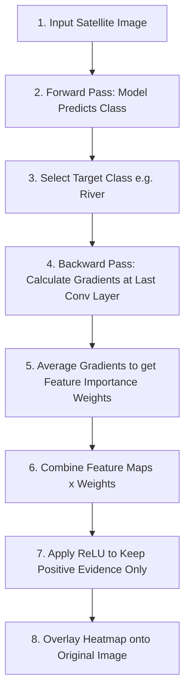

# Understanding Grad-CAM: The AI's Visual Highlighter 🎯

## 1. What is Grad-CAM? (In Plain English)

**Grad-CAM** stands for **Gradient-weighted Class Activation Mapping**.

In simple terms, **Grad-CAM is like a highlighter pen for Artificial Intelligence**.

When a Deep Learning model looks at an image and makes a decision—for example, saying *"This satellite photo shows a **River**"*—Grad-CAM shows us **EXACTLY which pixels or regions in the photo made the AI choose that answer**.

---

## 2. Why Do We Need Grad-CAM? (The "Black Box" Problem)

Traditional Neural Networks are often called **"Black Boxes"**:
- You put an **Image IN** 📥.
- The model outputs a **Prediction OUT** 📤 (*"Forest - 98% confidence"*).
- But **WHY** did it say Forest? Did it focus on the green trees, or was it distracted by a cloud or background noise?

```
[ Input Image ] ---> 📦 [ Black Box AI Model ] ---> "River (95%)"
                                |
                   (Without Grad-CAM, we don't 
                    know what the AI looked at!)
```

**Grad-CAM solves this mystery.** It acts as an **Explainable AI (XAI)** tool that turns the black box into a transparent box.

---

## 3. Real-World Analogy: The Detective & The Crime Scene 🕵️‍♂️

Imagine a detective deciding who committed a crime:
1. **The Guess**: The detective says, *"Person A is the culprit!"*
2. **The Clues (Gradients)**: The detective points to footprints near the window and fingerprints on the door.
3. **The Evidence Map (Grad-CAM)**: The detective places bright yellow sticky notes on those specific footprints and fingerprints.

Grad-CAM does the same thing for an AI model:
- **Prediction**: *"This is a Residential Area."*
- **Evidence Map**: Grad-CAM lights up the building roofs and streets in red/yellow, while ignoring empty fields.

---

## 4. How Grad-CAM Works: Step-by-Step

Here is the step-by-step breakdown of how Grad-CAM works under the hood, explained simply:



### Step 1: Forward Pass (The Model's Guess)
Pass the image through the Convolutional Neural Network (CNN, e.g., ResNet50). The model outputs probability scores for all classes (e.g., River: 92%, Forest: 5%, Highway: 3%).

### Step 2: Choose the Target Class
Select the class you want to explain (usually the top prediction, e.g., **River**).

### Step 3: Check the Last Convolutional Layer
Why the last conv layer? 
- Early layers detect basic features (edges, corners, colors).
- **The last conv layer detects high-level semantic concepts** (like water bodies, road layouts, tree clusters) while still retaining **spatial (location) information**.

### Step 4: Backward Pass (Calculating "Importance Signals" / Gradients)
We calculate how sensitive the final prediction score is to changes in the feature maps of the last conv layer.
- **High Gradient**: "If this region changes, the prediction score changes drastically!" 👉 **Very Important!**
- **Low Gradient**: "If this region changes, the AI doesn't care." 👉 **Not Important.**

### Step 5: Pooling / Weight Averaging
We average the gradients for each feature map channel to assign a single **"Importance Weight"** ($\alpha$) to each channel.

### Step 6: Weighted Combination & ReLU Filter
Multiply each feature map by its importance weight and sum them up. Then apply a **ReLU (Rectified Linear Unit)** function.
- **Why ReLU?** We only care about features that **positively contribute** to the target class (features that *prove* it's a River, not features that argue against it).

### Step 7: Create the Heatmap Overlay
Resize the resulting 2D grid to match the original image size and apply a color scheme (like a weather radar map).

---

## 5. How to Read the Heatmap Colors 🎨

The Grad-CAM output superimposes a rainbow heatmap over the original image:

| Color | Temperature | Meaning to the AI |
| :--- | :--- | :--- |
| 🔴 **Red / Magenta** | **Hot 🔥** | **Highest Importance**: Primary evidence for the classification. |
| 🟡 **Yellow / Green** | **Warm ☀️** | **Moderate Importance**: Secondary supporting context. |
| 🔵 **Blue / Purple** | **Cold ❄️** | **No Importance**: Ignored by the AI for this decision. |

---

## 6. Satellite Land Use Example (EuroSAT Dataset)

Here is how Grad-CAM behaves across different land classification types in our project:

### Example A: Classifying a "River" 🌊
- **Original Image**: A green landscape with a winding blue river running through the middle.
- **Model Output**: `River (96% Confidence)`
- **Grad-CAM Result**: The **red hot spot** traces directly along the curving blue water line. The surrounding green trees are blue (cold/ignored).
- **Conclusion**: The model correctly looks at the water channel, proving it learned the right concept!

### Example B: Classifying "Residential" 🏡
- **Original Image**: Clusters of small houses, rooftops, and connecting roads.
- **Model Output**: `Residential (94% Confidence)`
- **Grad-CAM Result**: **Red/Yellow highlights** cover the rooftops and road grids, ignoring open patches of grass.

---

## 7. Key Benefits of Grad-CAM in Satellite AI

1. **Builds Trust**: Users can verify if the AI is making decisions based on valid features rather than random shortcuts.
2. **Debugging Tool**: Helps detect AI biases (e.g., if the model classifies "Sea/Lake" based on boats instead of water).
3. **No Architecture Changes Needed**: Works with existing CNNs (ResNet, VGG, EfficientNet) without retraining the model.

---

## 8. Summary Cheat Sheet 📝

| Concept | Plain English Meaning |
| :--- | :--- |
| **Grad-CAM** | A tool that generates a color-coded heatmap showing what the AI looked at. |
| **Gradients** | Mathematical "importance scores" calculated during backward propagation. |
| **Last Conv Layer** | The layer in the neural net that understands complex shapes and locations. |
| **ReLU** | Filters out negative distractions to keep only positive evidence. |
| **Hot Colors (Red/Yellow)** | Regions that strongly convinced the AI of its prediction. |
