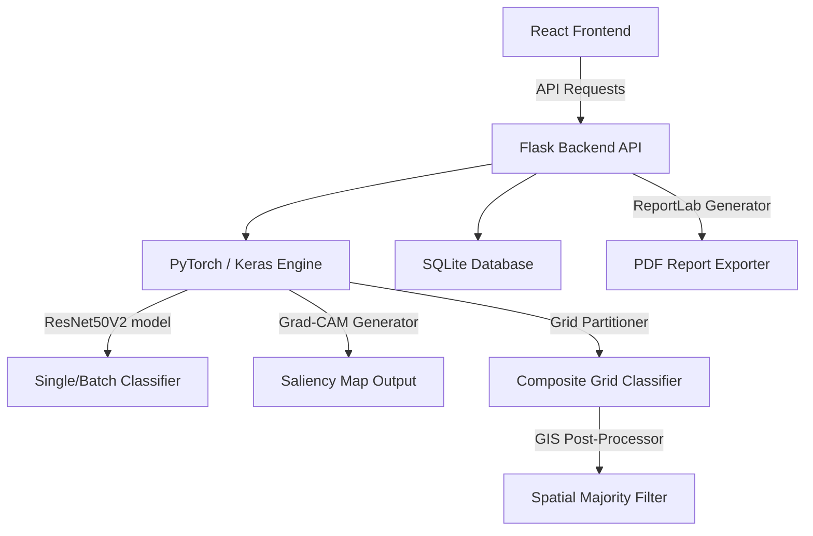
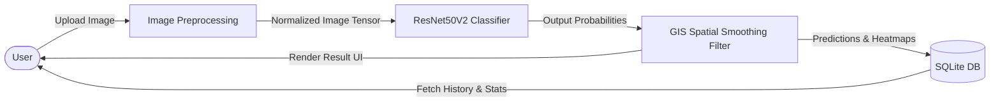

# Slide-by-Slide Outline for PPT: Satellite Land Classification & Explainable GIS Dashboard

---

## Slide 1: Title Slide (Topic)
* **Slide Title**: Explainable GIS Satellite Land Classification Dashboard
* **Subtitle**: Interactive Deep Learning Framework with Spatial Slicing & Change Detection
* **Presenter Information**: 
  * Prepared by: [Your Name / Roll Number]
  * Department: Master of Computer Applications (MCA)
  * Institution: [Your University/College Name]
* **Design Note**: Clean, high-contrast light background (off-white/light-grey) with dark navy text and clean GIS lines for maximum visibility on class projectors.

---

## Slide 2: Introduction
* **Core Concept**: Satellite remote sensing generates massive amounts of unstructured geographic data daily. Transforming this raw imagery into actionable Land Use and Land Cover (LULC) maps is critical for urban planning, environmental monitoring, and disaster response.
* **Key Focus**:
  * Leverages State-of-the-Art Deep Learning (ResNet50V2).
  * Focuses on EuroSAT land cover categorization.
  * Bridges the gap between black-box AI and human trust via Explainable AI (Grad-CAM heatmaps).

---

## Slide 3: Problem Statement
* **The Challenges in Current GIS Systems**:
  * **Black Box Nature**: Deep learning models predict classes without visual justifications, making them untrustworthy for critical agricultural or environmental policymaking.
  * **Scale Distortion Error**: Resizing large satellite composites directly to model dimensions (e.g. $64\times64$) ruins structural detail and distorts predictions.
  * **Out-of-Distribution Noise**: Small features like dirt paths or clearings in wild forests are frequently misclassified as urban "Residential" structures due to isolated pixels.
  * **Static Model Architectures**: Lack of real-time control to train, optimize, or evaluate models interactively based on GPU capability.

---

## Slide 4: Existing Systems
* **Characteristics of Traditional Pipelines**:
  * Standard machine learning models (e.g. Random Forest, SVM) requiring manual feature engineering.
  * Static models hosted on remote servers with no option for real-time retraining or tuning.
  * Lack of structural change detection and automated socio-environmental impact reporting.
  * Zero explainability (no visualization of what parts of the image triggered the classification).

---

## Slide 5: Proposed System
* **Key Innovations**:
  * **Interactive Explainability**: Dynamic Grad-CAM attention map generation on PyTorch to visualize classification cues.
  * **GIS Grid Partitioner**: Slices large-scale maps into local $64\times64$ segments to keep spatial scale intact.
  * **Neighborhood Smoothing (Majority Filter)**: Post-processing grid algorithm that cleans up isolated false-positive classifications.
  * **Transfer Learning Controller**: Real-time training pipeline directly connected to the web dashboard, with GPU acceleration (RTX 4060) support.
  * **Automated Change Detection & PDF Report Exporter**: Computes transition metrics between coordinate-aligned historical images.

---

## Slide 6: Software & Hardware Requirements
* **Hardware Configuration**:
  * **Processor**: Intel Core i7 / AMD Ryzen 7 (Multi-core CPU)
  * **Graphics Processor (GPU)**: NVIDIA GeForce RTX 4060 Laptop GPU (8GB VRAM) supporting CUDA 13.2 / cuDNN
  * **RAM**: 16 GB DDR5
  * **Storage**: 512 GB SSD (For dataset and model checkpoints)
* **Software Configuration**:
  * **Operating System**: Windows 11
  * **Programming Language**: Python 3.12 (for stable PyTorch CUDA support) & Javascript (ES6+)
  * **Frameworks**: Flask (Backend API), React.js + Vite (Frontend Dashboard)
  * **Deep Learning Engines**: Keras 3 (PyTorch backend), Torch 2.5.1 + CUDA 12.1

---

## Slide 7: System Architecture
* **System Component Overview**:

---

## Slide 8: Dataflow Diagram (DFD)
* **Level 1 Dataflow Pipeline**:

---

## Slide 9: Detailed Information about Dataset
* **Dataset Used**: EuroSAT (RGB Version)
* **Image Dimensions**: $64 \times 64$ pixels
* **Spatial Resolution**: 10 meters per pixel (collected by Sentinel-2 satellite)
* **Spectral Bands**: Standard Red, Green, Blue (RGB) spectrum
* **Dataset Size**: 27,000 labeled images (2,700 images per class)
* **Target Classes (10 classes)**:
  * AnnualCrop, Forest, HerbaceousVegetation, Highway, Industrial, Pasture, PermanentCrop, Residential, River, SeaLake

---

## Slide 10: Methodology
* **Workflow Steps**:
  1. **Data Preprocessing**: Image loading, scaling pixels to `[0, 1]` range, and feeding into model inputs.
  2. **Model Instantiation**: Standard ResNet50V2 base frozen for feature extraction. Fine-tuning unfreezes the last 30 layers.
  3. **Batch Classification**: Single/batch image outputs generated in JSON.
  4. **Explainability Extraction**: Saliency gradients computed on the PyTorch input tensor.
  5. **Grid Slicing & Smoothing**: Images cropped into non-overlapping tiles. Neighbors evaluated using a 3x3 majority voting algorithm.

---

## Slide 11: Model Training & GPU Configuration
* **Training Setup**:
  * **Processor Mode**: NVIDIA GPU acceleration (GeForce RTX 4060 Laptop GPU) active on local backend.
  * **Optimization Algorithm**: Adam Optimizer with a tailored fine-tuning learning rate of `5e-4`.
  * **Loss Function**: Sparse Categorical Crossentropy.
  * **Transfer Learning strategy**: Pre-trained ResNet50V2 base weights frozen for early convergence; top 30 layers unfrozen for domain-specific fine-tuning.
  * **Epoch Count**: 12 Epochs (with Early Stopping active on validation loss).
  * **Batch Configuration**: Batch Size of 32 for training stability.

---

## Slide 12: Classification Metrics & Validation Accuracy
* **Performance Results on EuroSAT**:
  * **Validation Accuracy**: **88.6%** (epoch-level peak).
  * **Test Accuracy**: **86.2%** (generalization rating on unseen datasets).
  * **Precision**: **86.3%** (low false-positive classification rate).
  * **Recall**: **86.2%** (low false-negative classification rate).
  * **F1-Score**: **86.1%** (harmonic balance between Precision and Recall).
* **Speedup**: GPU-accelerated training executes at **~200ms per step**, shortening a 12-epoch run to under 40 seconds.

---

## Slide 13: Confusion Matrix Analysis
* **Statistical Performance Breakdown**:
  * **Diagonal Dominance**: The diagonal of the 10x10 matrix shows high correct prediction counts across all 10 land cover types.
  * **Key Classification Insights**:
    * **Perfect Classification**: Class `Industrial` (row 4) was classified with 100% accuracy (50 out of 50 correct).
    * **Minor Class Ambiguity**: Small confusions exist between `AnnualCrop` and `PermanentCrop` (due to similar vegetation structures) and between `HerbaceousVegetation` and `Pasture` (due to shared grass signatures).
    * **GIS Mitigation**: The spatial majority filter successfully maps boundaries and eliminates isolated errors.

---

## Slide 14: System Features
* **Interactive Dashboard Sections**:
  * **Dashboard KPI Cards**: Visualizes total classifications, EuroSAT validation accuracy, and class distribution charts.
  * **Single Predict & Grad-CAM**: Outputs classification results side-by-side with heatmaps.
  * **Grid Classifier**: Features interactive cell inspectors and coverage breakdown graphs.
  * **Historical Change Detection**: Visual comparisons of land-use shift patterns with automated impact text.
  * **PDF Exporter & CSV Exporter**: Downloads complete, professional PDF analysis documents and CSV records.

---

## Slide 15: Technology Used
* **Frontend**: React, Lucide-React, Chart.js (with React-Chartjs-2), Vanilla CSS & Tailwind styling.
* **Backend**: Flask, Flask-CORS (Cross-Origin Resource Sharing).
* **Database**: SQLite3 (managed via Python standard library).
* **Deep Learning & Math**: PyTorch, Keras 3, NumPy, Pandas, Scikit-Learn.
* **Computer Vision**: OpenCV (cv2) for resizing, grid cropping, and heatmap overlay.
* **Reporting**: ReportLab (Python library for structural PDF building).

---

## Slide 16: Interface and Output Screenshots
* **Interface Visual Demonstrations**:
  * **Dashboard Panel**: Shows training charts, accuracy metrics, and target class distributions.
  * **Grad-CAM View**: Visualizes the original satellite image next to the model attention heatmap.
  * **Grid Classifier Slicing**: Renders the 16x30 cell grid mapped over `1_Planet.jpg` with color-coded land classification layers.
  * **Change Detection Report**: Compares images from different years, labeling environmental shifts.

---

## Slide 17: Future Scope
* **Proposed Extensions**:
  * **Multi-spectral Band Support**: Support Sentinel-2 13-band TIFF imagery (incorporating infrared, moisture, and vegetation indexes like NDVI).
  * **Real-time Map Integration**: Replace pre-cropped imagery with direct bounding-box API fetches from Sentinel Hub or Google Earth Engine.
  * **Segmentation Models**: Migrate from patch classification to semantic pixel segmentation (using U-Net or Segment Anything Model).

---

## Slide 18: References
* **Sources and Citations**:
  1. EuroSAT Dataset Benchmark: [https://github.com/phelber/EuroSAT](https://github.com/phelber/EuroSAT)
  2. PyTorch CUDA Installation: [https://pytorch.org/get-started/locally/](https://pytorch.org/get-started/locally/)
  3. Keras 3 Multi-Backend Guide: [https://keras.io/keras_3/](https://keras.io/keras_3/)
  4. Sentinel Hub GIS Services: [https://www.sentinel-hub.com/](https://www.sentinel-hub.com/)

---

## Slide 19: Conclusion
* **Summary**:
  * Successfully built a responsive, highly performant GIS Land Classification dashboard.
  * Upgraded backend to ResNet50V2 with local **RTX 4060 GPU acceleration** (under Python 3.12).
  * Resolved critical black-box and scale distortion limitations through Grad-CAM saliency mapping, grid slicing, and spatial majority post-processing.
  * Delivers a highly useful system for planning, environmental study, and student/viva presentations.
