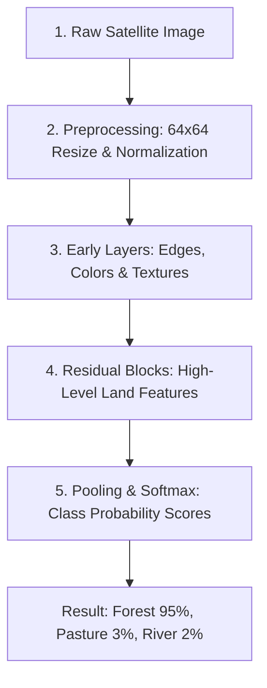

# How ResNet Performs Satellite Land Classification (In Simple Terms) 🛰️

## 1. What is ResNet?

**ResNet** stands for **Residual Network** (specifically **ResNet-50 v2** in this project).

It is a specialized **Deep Learning Neural Network** designed to recognize patterns inside images. 

Imagine trying to pass a message down a line of 50 people. In a regular network, the message gets garbled or forgotten by the time it reaches the 50th person (this is called the **"vanishing gradient problem"**). 

ResNet introduces **"Skip Connections" (shortcuts)** that let information bypass layers, ensuring the network remembers key details no matter how deep it gets.

```
[ Input ] ---> [ Layer 1 ] ---> [ Layer 2 ] ---> [ Output ]
    |                                                ^
    +---------------- (Skip Connection) -------------+
```

---

## 2. The 5 Steps of ResNet Land Classification

Here is how ResNet transforms a raw satellite photo into a land category prediction:



---

### Step 1: Preprocessing (Getting the Image Ready) 🖼️
Before ResNet looks at the satellite photo:
- The image is resized to **64 × 64 pixels**.
- Pixel colors (RGB values from 0 to 255) are scaled to numbers between **0.0 and 1.0**.

---

### Step 2: Early Convolutional Layers (Finding Basic Clues) 🔍
The first few layers act like magnifying glasses scanning tiny patches of the image. They look for simple visual building blocks:
- **Colors**: Blue patches (water), green patches (vegetation), grey patches (concrete).
- **Edges**: Straight lines, curves, corners.

---

### Step 3: Middle Layers (Putting Shapes Together) 🧩
As data flows deeper, ResNet combines simple edges into recognisable patterns:
- **Grid patterns** $\rightarrow$ Rows of crops or streets.
- **Parallel lines** $\rightarrow$ Highways or rivers.
- **Textured clusters** $\rightarrow$ Tree canopies in a forest.

---

### Step 4: Deep Residual Blocks (Building High-Level Concepts) 🏗️
This is where ResNet's magic happens. Deep layers assemble patterns into full concepts:
- *"Green texture + irregular boundaries"* $\rightarrow$ **Forest**
- *"Rectangular roofs + roads + grey surfaces"* $\rightarrow$ **Residential / Industrial**
- *"Winding dark blue line across green terrain"* $\rightarrow$ **River**

Thanks to **Skip Connections**, ResNet can stack 50 layers without losing focus or accuracy!

---

### Step 5: Pooling & Softmax (Making the Final Decision) 📊
At the end of the network:
1. **Global Average Pooling**: Summarizes the entire 2D feature map into a single list of numbers.
2. **Softmax Classifier**: Converts those numbers into percentage confidence scores across the **10 EuroSAT Land Classes**:

| Land Class | Confidence Score | Status |
| :--- | :--- | :--- |
| **Forest** | **95.2%** | 🏆 **Predicted Winner** |
| Pasture | 3.1% | Runner-up |
| Herbaceous Vegetation | 1.1% | Low |
| River | 0.6% | Low |

---

## 3. Real-World Example: How ResNet Distinguishes Similar Classes

Satellite images can be tricky! ResNet uses deep feature combinations to tell similar land types apart:

| Land Type | Key Features ResNet Looks For |
| :--- | :--- |
| 🌾 **Annual Crop** | Ploughed soil lines, uniform crop rows, seasonal color variations. |
| 🌲 **Forest** | Dense green clusters, bumpy top-down tree textures, shadow variations. |
| 🏡 **Residential** | Small building rooftops, regular grid streets, backyard gardens. |
| 🏭 **Industrial** | Large flat warehouse roofs, parking lots, wide transit roads. |
| 🛣️ **Highway** | Long straight/curved asphalt strips cutting across open land. |

---

## 4. Summary Table

| Step | What ResNet Does | Simple Analogy |
| :--- | :--- | :--- |
| **Input** | Takes $64\times64$ pixel satellite image | Looking at a photograph |
| **Early Layers** | Finds edges, lines, and raw colors | Identifying basic sketch lines |
| **Skip Connections** | Passes raw details across deep layers | Using a cheat-sheet so you don't forget original details |
| **Deep Layers** | Combines patterns into land types | Recognizing full objects (roofs, rivers, trees) |
| **Softmax** | Outputs percentage scores for 10 classes | Voting system to pick the most likely land type |
